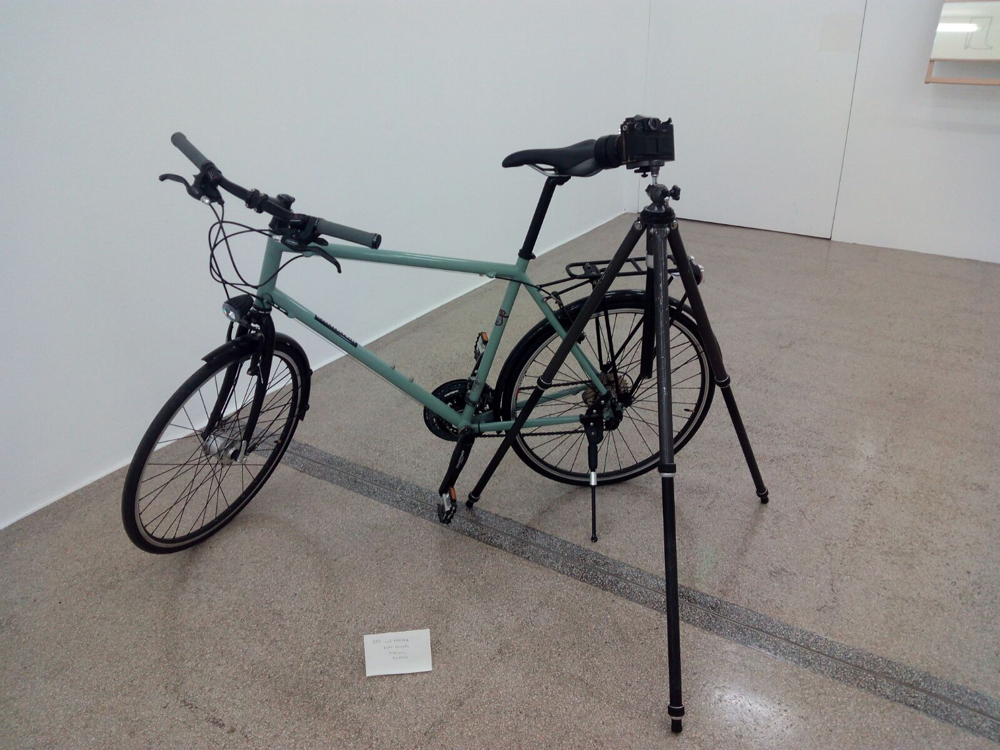
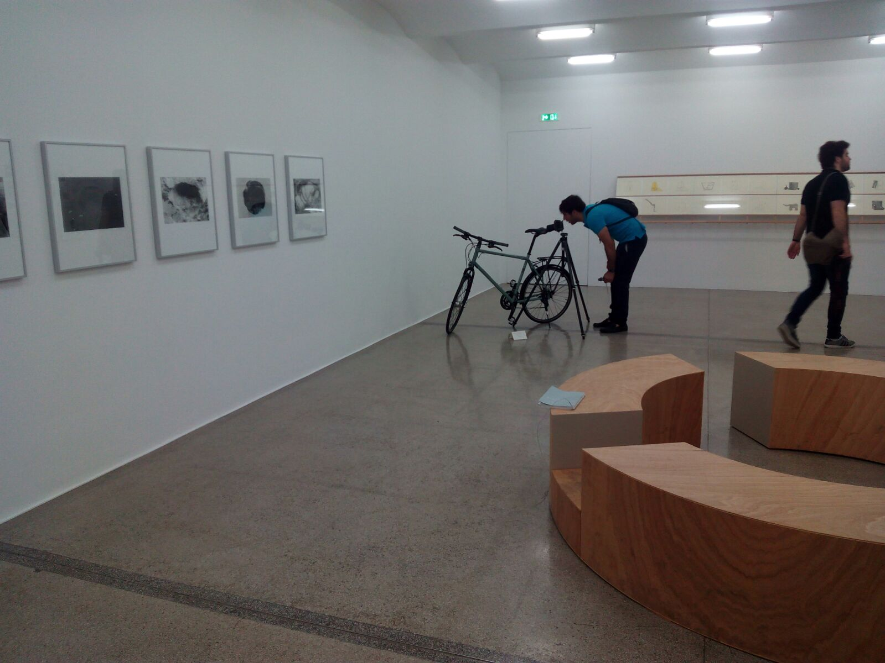
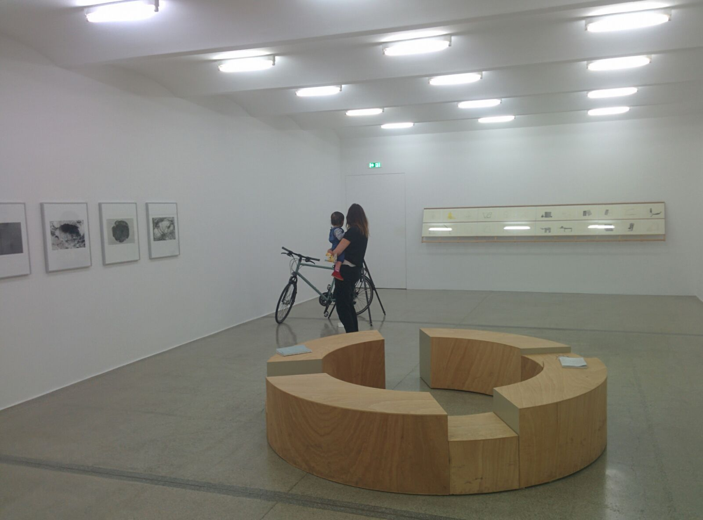
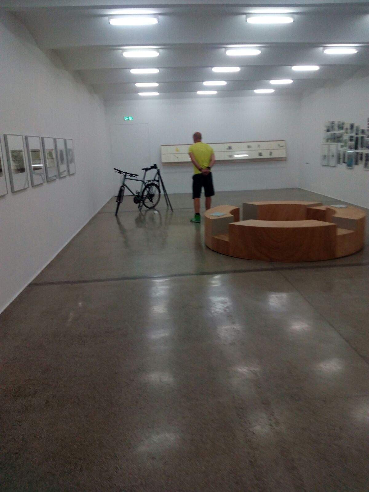

El hastío es una cosa terrible, pero algunas veces produce resultados memorables. Por ejemplo: En un museo de Viena, en la esquina de la última sala, para digitalizar obrillas, apoyada en una bicicleta, veíase una cámara.

En el momento en el que mi amigo Jorge Gª Couto y yo la vimos, la sala estaba desierta, y en un arrebato de malicia separamos una hoja de mi cuaderno. Por una cara, escribimos "RAD und KAMERA, Nestor Dempster, 19/06/1943, Frankreich" y por la otra "BIKE and CAMERA, Nestor Dempster, 19/06/1943, France". La fecha se corresponde al día de la fechoría durante el período de ocupación alemana de Francia, y el autor es un alias que ya tenía yo pensado. Cuidadosamente, doblamos la hoja en forma de cartelito y la pusimos delante de la cámara.

Y esperamos. Poco después gotearon los primeros visitantes, ante los cuales nos pusimos a alabar la obra y a hacernos alguna foto junto a ella:

El ilustrísimo Jorge García Couto, cogamberro.

Y los visitantes, cual babuinos, nos imitaron. Recuerdo afectuosamente a dos franceses que la comentaron con un tono exquisitamente gálico. El rehuir de la conspicuidad nos impidió producir más testimonios, pero aún así conseguimos capturar alguna instantánea curiosa:

C'est magnifique, vraiment magnifique.

Madre con bebé, Nestor Dempster, 19/07/1990, Unión Soviética.

Es ist wie die Fontäne von Duchamp.

Tan solo alabamos la obra antes de la primera foto, pues tras ver los resultados, nuestra sorpresa fue máxima y de anonadados, no pudimos seguir actuando con seriedad y nos limitamos a observar. En definitiva, una anécdota con ángel, con cierto aire al concierto de flauta de Cela.

Y teniendo a Cela me vienen con citas de Winston Churchill y demás sandeces.
Fuente: Entrevista de La Vanguardia

Dejo como ejercicio para el lector desentrañar las implicaciones en lo que a apreciación artística respecta.

