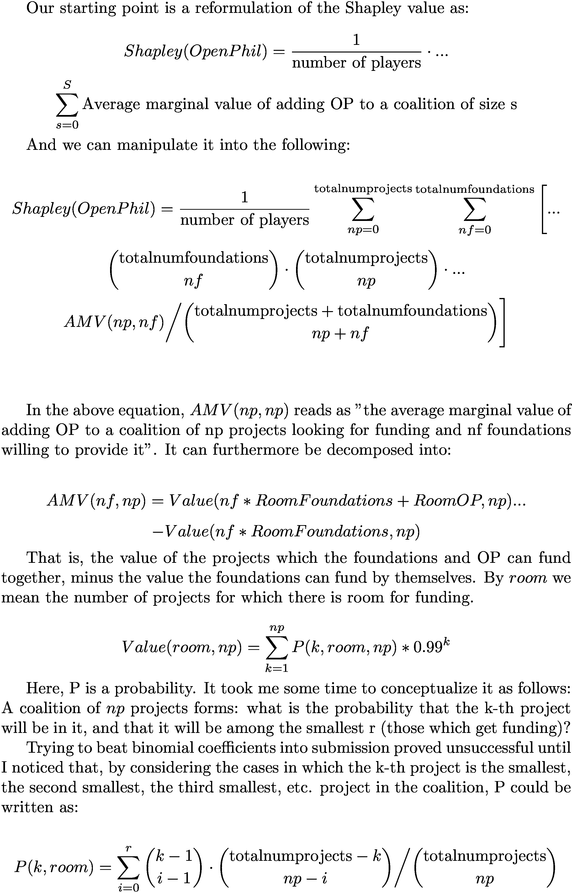

# Shaple value for Global coordination

## Introduction

The Shapley value can be used to think more clearly about impact attribution. Here, we give some silly examples which should allow the reader to grasp the concept more clearly, and to contrast it with the pure counterfactual value. We then apply the concept to OpenPhilantropy and Charity Entrepeneurship, and extract some recommendations for the two organizations.

Normally, the calculation of the Shapley Value for n=1000 would be computationally intractable. However, for the case of a set of foundations looking to fund projects, there is some additional structure which we can exploit in order to make the Shapley value computable; we present this as a new result.

## The Shapley value formula.

The value added by person i = (1/number of players) * sum over coalitions of {marginal contribution of adding i to a coalition / number of coalitions excluding i of the same size}

[Source](https://en.wikipedia.org/wiki/Shapley_value). It has some good properties which make it a "natural" way to distribute impact. For the reader who has not seen Shapley values before, the Wikipedia page is a good introduction.

## Lines of attack to the Shapley value.
It weighs all coalitions equally, without taking into account how likely it is for a given coalition to form. Additionally, while the properties of efficiency, symmetry, null-player anonymity seem natural and desirable, the assumption of linearity doesn't seem that essential.

## Newton and Leibniz.

Consider Newton and Leibniz, which both invented Calculus. If we remove either of them, calculus would still have been invented.  What, then, was their contribution?

The counterfactual value of Newton is 0. If Newton hadn't existed, Leibniz would have discovered/invented it anyways.  
The counterfactual value of Leibniz is 0. If Leibniz hadn't existed, Newton would still have discovered/invented it.  
The sum of their counterfactual values is 0 + 0 = 0.  

The Shapley value is different, and is calculated as follows. The possible coalitions are: {}, {Newton}, {Leibniz}, {Newton, Leibniz}.

ShapleyValue(Leibniz) = 1/2 * [ (Value of adding Lebniz to coalition {} / Number of coalitions of the same size as {}) + (Value of adding Lebniz to coalition {Newton} / Number of coalitions excluding Leibniz of the same size as {Newton}) ]

If the value of creating calculus is 1, then:

Value of adding Lebniz to coalition {} = 1  
Number of coalitions excluding Leibniz of the same size as {} = 1  
Value of adding Lebniz to coalition {Newton} = 0  
Number of coalitions excluding Leibniz of the same size as {Newton} = 1  

Value(Leibniz) = 1/2 * (1/1 + 0/1) = 1/2

Because the situation for Newton is symmetrical, and also because Value(Newton) = 1 - Value(Leibniz),

Value(Newton) = 1/2

So according to the Shapley solution, they each get 50% credit.

## Aaron Swartz Institute for Mental Health.

[Aaron Swartz](https://en.wikipedia.org/wiki/Aaron_Swartz) was an Elon Musk who commited suicide when young. [His blog](http://www.aaronsw.com/weblog/) is still up, and it's still interesting. So if you could give mental health treatment to him (and have it work), you'd get half a lifetime of a genius on the side of humanity. Suppose that the value of that, in whatever units, is 1. 

Consider thus the fictional Aaron Swartz Institute for Mental Health, spearheaded by a mad scientist whose mission is to go back in time and give Aaron Swartz a copy of *Feeling Good*, by David Burns. 

Thus, you have a coalition made out of:
- Aaron Swarz (AS)
- David Burns (DB)
- The mad scientist (MS)

The number of possible coalitions is: 2^3 = 8. They are, respectively: {}, {AS}, {DB}, {DB, AS}, {MS}, {MS, AS}, {MS, DB}, {MS, DB, AS}. We can also represent this as: 000, 001, 010, 011, 100, 101, 110, 111, where, e.g. the first digit represents whether the mad scientist is in the group or not.

If the project gets completed, what is the value of each player?

### Aaron Swartz

Value(AS) = 1/3 * [(Value of adding him to {} / 1) + (Value of adding him to {DB}/2) + (Value of adding him to {MS}/2) + (Value of adding him to {MS, DB}/1) ]

Value of adding him to {} = 0  
Number of coalitions excluding him of size 0 = 1  
Value of adding him to {DB} = 0  
Value of adding him to {MS} = 0.4 // The mad scientist tries to talk to him, but he's not very convincing  
Number of coalitions excluding him of size 1 = 2  
Value of adding him to {MS, DB} = 1  
Number of coalitions excluding him of size 2 = 1  

Value(AS) = 1/3 * (0/1 + 0/2 + 0.4/2 + 1/1) = 0.4  

### David Burns

Value(AS) = 1/3 * [(Value of adding him to {} / 1) + (Value of adding him to {MS}/2) + (Value of adding him to {AS}/2) + (Value of adding him to {MS, AS}/1) ]

If David Burns writes the book, but there is nobody, his impact is 0. If he exists in the same universe as Aaron Swartz, but the mad scientist isn't there to get it to him, his impact is also 0. If he and the mad scientist exist, but not Swartz, there is also no impact. 

Value(DB) = 1/3 * [(Value of adding him to {} / 1) + (Value of adding him to {AS}/2) + (Value of adding him to {MS}/2) + (Value of adding him to {MS, AS}/1) ]

Value of adding him to {} = 0  
Number of coalitions excluding him of size 0 = 1  
Value of adding him to {AS} = 0  
Value of adding him to {MS} = 0  
Number of coalitions excluding him of size 1 = 2  
Value of adding him to {MS, AS} = 1-0.4 = 0.6 // These are MARGINAL values.  
Number of coalitions excluding him of size 2 = 1  

Value(AS) = 1/3 * (0/1 + 0/2 + 0/2 + 0.6/1) = 0.2

### Mad scientist.

Value(MS) = 1/3 * [(Value of adding him to {} / 1) + (Value of adding him to {DB}/2) + (Value of adding him to {AS}/2) + (Value of adding him to {AS, DB}/1) ]

Value of adding him to {} = 0  
Number of coalitions excluding him of size 0 = 1  
Value of adding him to {DB} = 0  
Value of adding him to {AS} = 0.4  
Number of coalitions excluding him of size 1 = 2  
Value of adding him to {AS, DB} = 1  
Number of coalitions excluding him of size 2 = 1  

Value(MS) = 1/3 * (0/1 + 0/2 + 0.4/2 + 1/1) = 0.4

Total value = 0.4 + 0.2 + 0.4 = 1 (checks out)

### Counterfactual values:
Counterfactual value of AS = 1  
Counterfactual value of MS = 1  
Counterfactual value of DB = 0.6  
Sum of the counterfactual values = 2.6  

### Why is this important

Because instead of a mad scientist going back in time, you could establish that foundation now, and hand exceptional but depressed people a copy of the *Feeling Good* book, which is something I sometimes do. 

On a meta-level, we have seen two cases which are not smoothly handled when thinking in terms of counterfactual values. In the case of Newton and Leibniz, either had 0 counterfactual impact when creating calculus, and yet the Shapley value handles that smoothly, giving 50% credit to each.

On the Aaron Schwarz case, the sum of the counterfactual impacts exceeded the impact of the thing. In general, if you have n people which are all needed to make a project work, the counterfactual value will far exceed the impact of the project. Further, if you assign status to the counterfactual impact of a thing, perverse incentives may arise, with advice such as "make yourself indispensable", and the [bus factor](https://en.wikipedia.org/wiki/Bus_factor) might increase. The Shapley value handles those cases more smoothly.

## Ideas for Charity Entrepeneurship.
Intuitively, if a group of people are maximizing their counterfactual impact, a failure mode might be to converge on complex projects in which each part is indispensable (because then every member has as a counterfactual the failure of the whole project). If instead they are looking to maximize their Shapley value, smaller projects which have more (total impact / number of people involved) will get filled first, and more impact will result overall.

Similarly, Charity Entrepeneurship is creating NGOs. An important question to ask is: Is a given project still worth it if, instead of getting the counterfactual impact, we get (counterfactual impact / number of organizations involved) ~ Shapley Values?

This is applicable to, for example: mental health interventions, sending reminder text messages to parents of children due for their immunizations, but not applicable to: fortifying flour with iron and folic acid, salt iodization.

## Open Philantropy example

Suppose that within the EA community, OpenPhilantropy, a foundation whose existence I appreciate, has the opportunity to fund 250 out of 500 projects every year. Say that you also have 10 smaller foundations, Foundation1...Foundation10, each of which can afford to fund 20 projects, that there aren't any more sources of funding, and that each project costs the same. 

On the other hand, we will also consider the situation in which OpenPhil is a monopoly. In the end, perhaps all these other foundations and centers might be founded by OpenPhilantropy themselves. Consider the assumption that OpenPhil has the opportunity to fund 450 projects out of 500, and  that there are no other sources in the EA community.

Additionally, we could model the distribution of projects with respect to how much good they do in the world by ordering all projects from 1 to 500, and saying that:
- Impact1 of the k-th project = I1(k) = 0.99^k.
- Impact2 of the k-th project = I2(k) = 2/k^2 (a power law).

With that in mind, here are our results for the different assumptions:

| Open Phil is a monopoly? | Impact measure | CI(OpenPhil) | Σ CI(Other Foundations) | Σ CI(Projects) | Σ CI   | Total Impact | Σ CI > Total impact? | Shapley(OpenPhil) | Power index = Shapley(OpenPhil) / Total Impact |
|--------------------------|----------------|--------------|-------------------------|----------------|--------|--------------|----------------------|-------------------|------------------------------------------------|
| 0                        | I(k) = 0.99^k  | 12.37        | 0.21                    | 93.09          | 107.55 | 97.92        | Yes                  | 7.72              | 7.89%                                          |
| 0                        | I(k) = 2/k^2   | 0.0055       | 0.0043                  | 3.281          | 3.29   | 3.29         | About the same       | 0.028             | 0.86%                                          |
| 1                        | I(k) = 0.99^k  | 97.92        | 0                       | 97.92          | 195.85 | 97.92        | Yes                  | 49.15             | 50%                                            |
| 1                        | I(k) = 2/k^2   | 3.29         | 0                       | 3.29           | 6.58   | 3.29         | Yes                  | 1.64              | 50%                                            |

## An original result pertaining the above:
The Shapley value is too computationally expensive to naïvely calculate; it would require us to consider 2^1011 coalitions. In general, for large values the Shapley value will not be computationally tractable. See, for example:

> This was a very simple example that we’ve been able to compute analytically, but these won’t be possible in real applications, in which we will need the approximated solution by the algorithm. 
> Source: https://towardsdatascience.com/understanding-how-ime-shapley-values-explains-predictions-d75c0fceca5a

Or 

> The Shapley value requires a lot of computing time. In 99.9% of real-world problems, only the approximate solution is feasible. An exact computation of the Shapley value is computationally expensive because there are 2^k possible coalitions of the feature values and the “absence” of a feature has to be simulated by drawing random instances, which increases the variance for the estimate of the Shapley values estimation. The exponential number of the coalitions is dealt with by sampling coalitions and limiting the number of iterations M. Decreasing M reduces computation time, but increases the variance of the Shapley value. There is no good rule of thumb for the number of iterations M. M should be large enough to accurately estimate the Shapley values, but small enough to complete the computation in a reasonable time. It should be possible to choose M based on Chernoff bounds, but I have not seen any paper on doing this for Shapley values for machine learning predictions.
> Source: https://christophm.github.io/interpretable-ml-book/shapley.html#disadvantages-13

However, for the case of foundations pairing off with projects, I've found out a simpler closed form solution which is more easily computable. As far as I'm aware, the result is original. Notable is that we have reduced our task to computing ~four nested for loops, making our formula O(x^3 * y), as opposed to O(2^x), where x=1011, the number of players in the game and y= number of projects for which there is funding, and this makes our task tractable. In R, our code runs in 20 to 50 minutes, depending on the impact function we choose:

We can rewrite the Shapley value of OpenPhil as:




## Code:
```
AMV <-function(foundations, roomforfoundingfoundations, roomforfoundingOP, projects, numprojects){

  avm = ValueOfFunded((foundations*roomforfoundingfoundations + roomforfoundingOP), projects, numprojects) - ValueOfFunded(foundations*roomforfoundingfoundations, projects, numprojects)
  # Note that the code could easily be optimized by computing both calls to ValueOfFunded at the same time. However, this loses clarity.
  
  return(avm)
  
}

ValueOfFunded <-function(room, projects, numprojects){
  value = 0
  for(k in c(1:numprojects)){
    #print(c("k=",k))
    value = value + ProbabilityThatKwillBeAmongTheRSmallestNumbers(k,room,projects, numprojects)*Impact(k)
  }
  #print(c("value=", value))
  return(value)
  
}

ProbabilityThatKwillBeAmongTheRSmallestNumbers <-function(k,r,q,n){
  #print(c("k=",k,"r=", r,"q=",q,"n=",n))
  ## Probability that K is the i-th smallest number =
  ## = choose(k-1,i-1)*choose(n-1,p-i-1)/choose(n,p)
  p=0
  for(i in c(0:r)){
    # we notice that all of the terms contain the factor choose(n,p), so we can leave it at the end.
    p=p+(choose(k-1,i-1)*choose(n-k,q-i))
  }
  p = p/ choose(n,q)
  return(p)
}


ComputeShapleyValue <-function(numfoundations, roomforfoundingfoundations, roomforfoundingOP, numprojects){
  ShapleyValue = 0
  for(Foundations in c(0:numfoundations)){
    for(Projects in c(0:numprojects)){
      print(paste("We're at: (",Foundations,"/", Projects, ") of (", numfoundations,",", numprojects, ")" , sep=""))
      ShapleyValue = ShapleyValue+choose(numfoundations,Foundations)*choose(numprojects,Projects)*AMV(Foundations, roomforfoundingfoundations, roomforfoundingOP, Projects, numprojects)/choose(numprojects+numfoundations, Foundations+Projects)
    }
  }
  return(ShapleyValue/(numfoundations+numprojects+1))
}

ComputeShapleyValue(1, 1, 1, 3)
ComputeShapleyValue(1, 1, 2, 3)

ComputeShapleyValue(numfoundations=1, roomforfoundingfoundations=1, roomforfoundingOP=1, numprojects=3)

Impact <- function(k){
  #return(0.99^k)
  return(2/(k^2))
}

## IT WORKS!!!!

start <- Sys.time()
ComputeShapleyValue(numfoundations=10, roomforfoundingfoundations=10, roomforfoundingOP=10, numprojects=500)
end <- Sys.time()
end-start
sum(0.99^c(1:500))

start <- Sys.time()
ComputeShapleyValue(numfoundations=10, roomforfoundingfoundations=20, roomforfoundingOP=250, numprojects=500)
end <- Sys.time()
end-start
sum(0.99^c(1:500))

# With a different impact measure.
start <- Sys.time()
ComputeShapleyValue(numfoundations=10, roomforfoundingfoundations=20, roomforfoundingOP=250, numprojects=500)
end <- Sys.time()
end-start
sum(2/(c(1:1000))^2)```

```

## Sources
https://en.wikipedia.org/wiki/Shapley_value  
https://christophm.github.io/interpretable-ml-book/shapley.html  
https://towardsdatascience.com/understanding-how-ime-shapley-values-explains-predictions-d75c0fceca5a  
https://towardsdatascience.com/one-feature-attribution-method-to-supposedly-rule-them-all-shapley-values-f3e04534983d  
https://www.eeg.tuwien.ac.at/conference/iaee2017/files/presentation/Pr_662_Jamasb_Tooraj.pdf (This last one is an interesting use fo Shapley values for international coordination)
