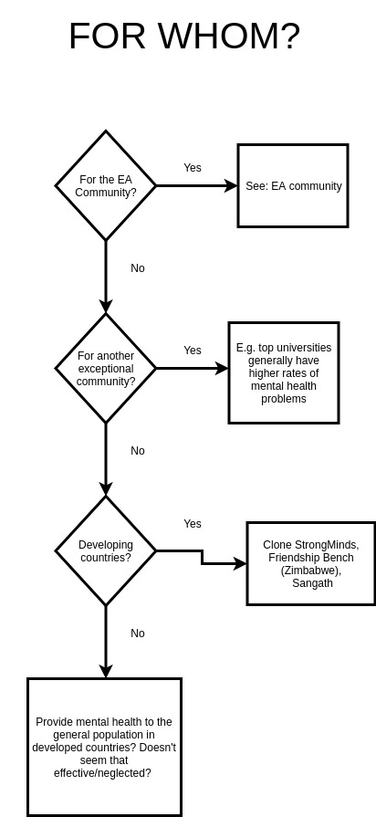
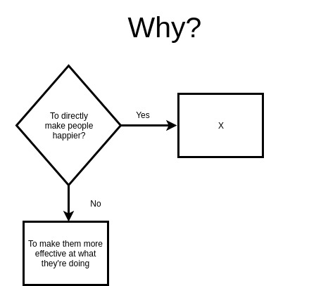
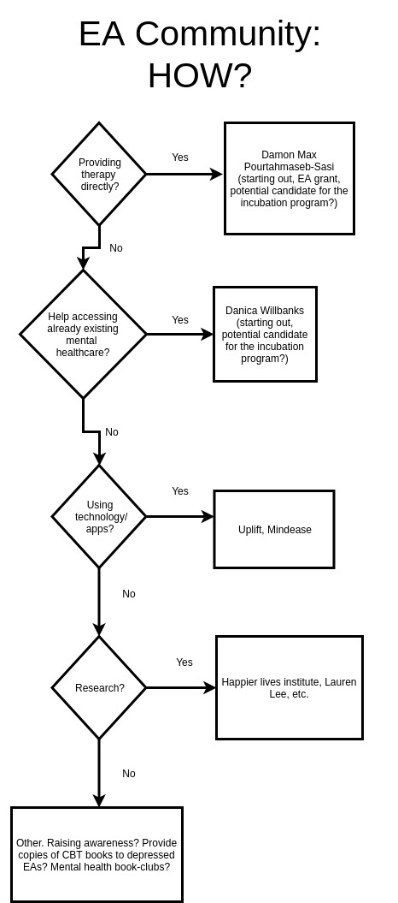

# Maps of mental health charities possibility space

Date of creation: 13-09-2019

> Duplicate StrongMind's model in other countries. A representative I talked to said they would be interested in helping clone charities get off the ground.  
Source: [Mental Health Shallow Review
](https://forum.effectivealtruism.org/posts/if24DY4pW2FZPPT4G/mental-health-shallow-review)
