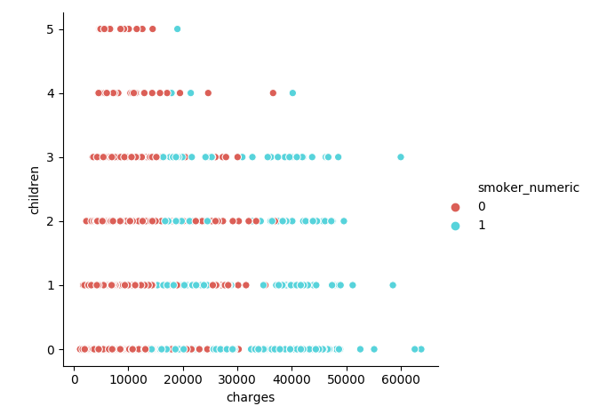
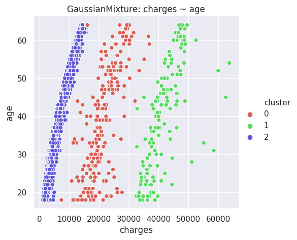
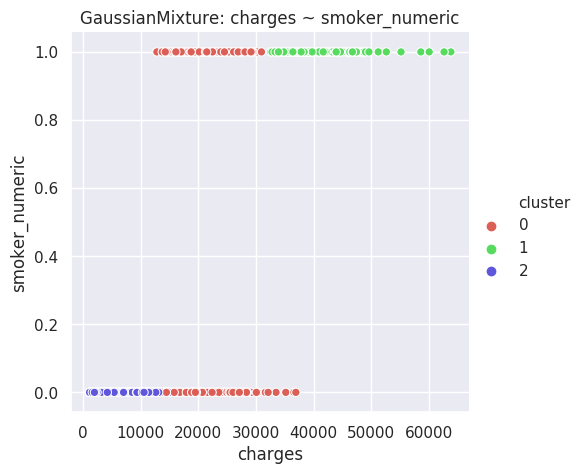
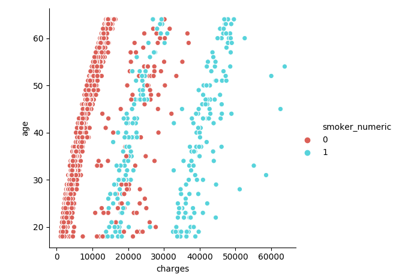
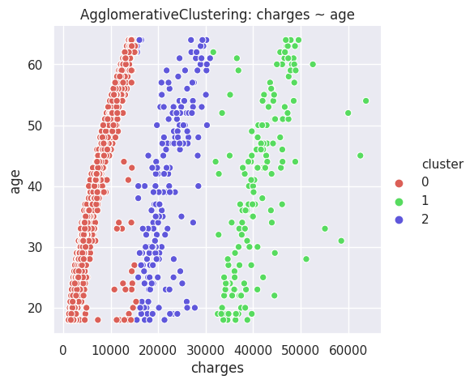
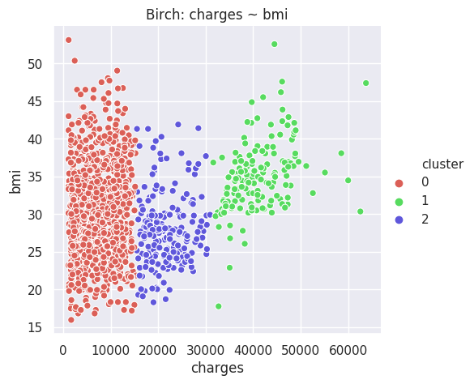

# Machine Learning Demystified

Several friends encouraged me to apply to a Data Scientist position at ID Insights, an organization I greatly admire, and for a position which I would be passionate about. I decided to apply. Beforehand, I familiarized myself throrougly with numpy, pandas and sklearn, three of the most important libraries for machine learning in Python.

I used a dataset from Kaggle: [Health Care Cost Analysis](https://www.kaggle.com/flagma/health-care-cost-analysys-prediction-python/data), referenced as "insurance.csv" thoughout the code. The reader will also have to change the variable "directory" to fit their needs.

Otherwise, the current files in this directory are:

- [CleaningUpData.py](https://github.com/NunoSempere/nunosempere.github.io/blob/master/maths-prog/MachineLearningDemystified/CleaningUpData.py). I couldn't work with the dataset directly, so I tweaked it somewhat.
- [AlgorithmsClassification.py](https://github.com/NunoSempere/nunosempere.github.io/blob/master/maths-prog/MachineLearningDemystified/AlgorithmsClassification.py). As a first exercise, I try to predict whether the medical bills of a particular individual are higher than the mean of the dataset. Some algorithms, like Naïve Bayes, are not really suitable for regression, but are great for predicting classes. After the first couple of examples, I wrapp everything in a function.
  - Algorithms: Naïve Bayes (Bernoulli & Gaussian), Nearest Neighbours, Support Vector Machines, Decision Trees, Random Forests (and Extrarandom forests), and multilayer perceptron (simple NN).
- [AlgorithmsRegression.py](https://github.com/NunoSempere/nunosempere.github.io/blob/master/maths-prog/MachineLearningDemystified/AlgorithmsRegression.py). I try to predict the healthcare costs of a particular individual, using all the features in the dataset.
  - Algorithms: Linear Regression, Lasso, Nearest Neighbours Regression, LinearSVR, SVR with different kernels, Tree regression, Random forest regression (and extra-random forest regression), and multilayer perceptron regression (simple NN).
- [Clustering.py](https://github.com/NunoSempere/nunosempere.github.io/blob/master/maths-prog/MachineLearningDemystified/Clustering.py). I then studied some of the most common clustering algorithms. The area seems almost pre-Aristotelian. Clustering algorithms get the task to *[send a message to Garcia](https://courses.csail.mit.edu/6.803/pdf/hubbard1899.pdf)*, and they undertake the task, no questions asked. Heroically. I also take the opportunity here to create some visualizations, with the seaborn library.
  - Algorithms: KMeans, Affinity Propagation, Mean Shift, Spectral Clustering, Agglomerative Clustering, DBSCAN, Birch, Gaussian Mixture.

## Thoughts on sklearn

The exercise proved highly, highly instructive, because sklearn is really easy to use, and the [documentation](https://scikit-learn.org/stable/) is also extremely nice. The following captures my current state of mind:

It came as a surprise to me that understanding and implementing the algorithm were two completely different steps.

## Some visualizations and findings about the dataset.

- Those who have 4+ children get charged less by insurance, and smoke less.

- The disgreggation by age seems interesting, because there are three prongs, roughly: 1) normal people who don't smoke, 2) those who get charged more: made out of those who don't smoke, and 3) those who get charged a lot, which only comprises smokers. The Gaussian Mixture & K-Means algorithms do better than most others at discriminating between these threee groups, and made me realize the difference.

- BMI is interesting, because there seems to be a line at BMI = 30, almost as if someone used that to make decisions about how much to charge, or what to diagnose. Normally, we'd expect something more continuous.

