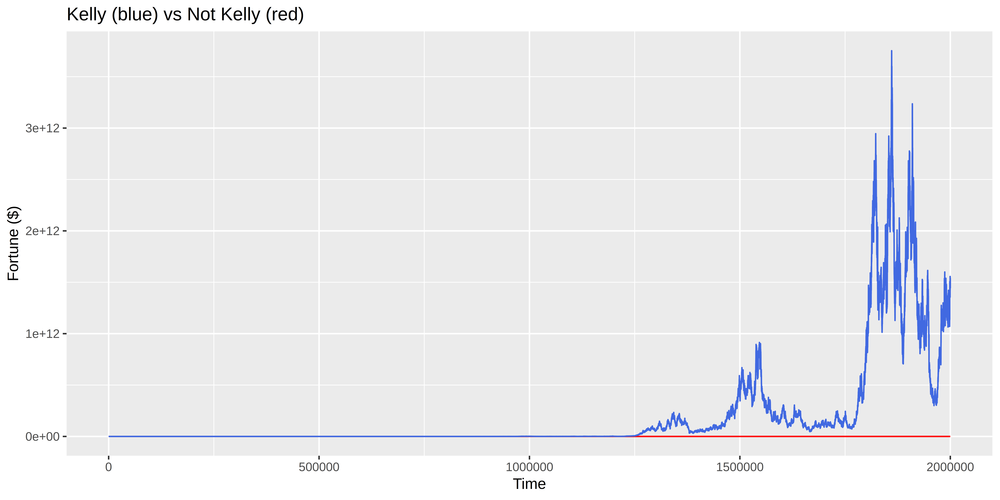
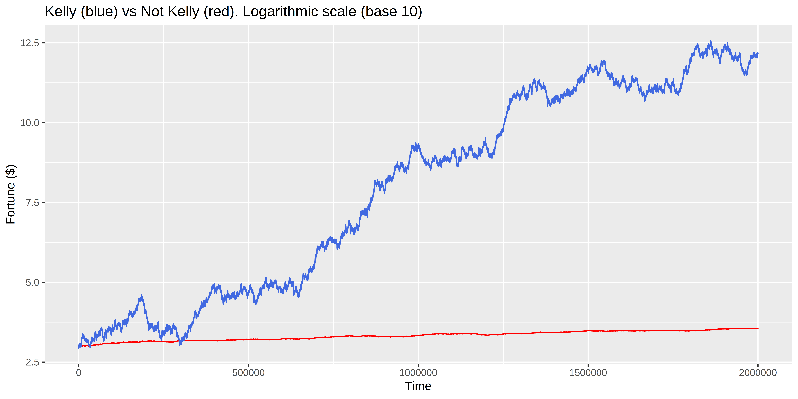
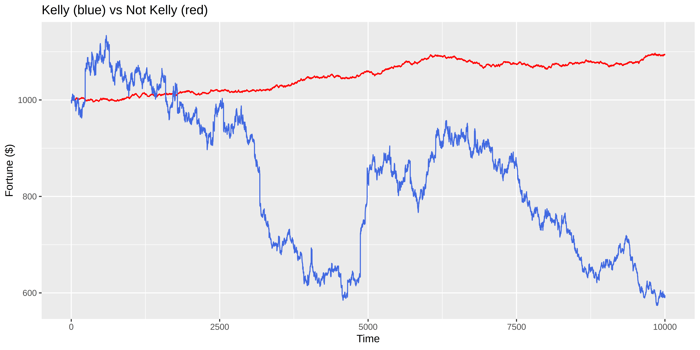

# On the Recalcitrance of Granularity and Knowledge Integration - An Answer to Sebastian Benthall's ["Don't Fear the Reaper: Refuting Bostrom's Superintelligence Argument"](https://arxiv.org/abs/1702.08495)

## Abstract
In his criticism of Bostrom, Sebastian Benthall shows how considering recalcitrance, the resistance of a system to improvement, is potentially useful when thinking about intelligence growth. Here, I consider the recalcitrance of granularity when making predictions, and construct a simple toy model in which an agent with higher granularity amasses all the resources of a toy world. With less depth, I also consider the recalcitrance of knowledge integration.

## 1. Benthall's core points.
Benthall's Proposition 3: The rate of change in intelligence is equal to optimization power divided by recalcitrance. dI/dt = O / R.
Optimization power refers to the effort of improving the intelligence of the system. Recalcitrance refers to the resistance of the system to being improved.

Benthall focuses on prediction as well-studied problem and an important part of what it means for an agent to be intelligent. He then considers the recalcitrance of accuracy, speed, prior and data. Seeing that the recalcitrance of the first three tends to infinity at the limit, he concludes that an intelligence explosion is not possible.

A possible counterargument could be that the recalcitrance at the limit doesn't matter if that limit doesn't kick in before the agent has already greatly exceeded humans in intelligence. Moreover, the fact that Benthall is not able to find a factor in which recalcitrance isn't infinity at the limit doesn't mean that it doesn't exist. That is, Benthall's argument rests on the assumption that his categorization is exhaustive. I claim that is not the case.

## 2. Initial comments

The factors he considers are: accuracy, speed, prior and data. For clarity, he defines accuracy as:
> A system can improve its ability to compute the mathematical function of the Bayesian update. Many widely used statistical inference algorithms use numerical approximation rather and so it is possible for a system to improve its algorithm’s faithfulness to the mathematical formula that defines its goal.

and, with respect to its recalcitrance:
> It may be possible for a system to inspect itself and determine ways to modify its own algorithm to make it more accurate at computing a Bayesian update. However there is a hard limit to improvements of this kind. No system can compute a Bayesian update more accurately than computing it perfectly accurately. Therefore, in the limit, recalcitrance of computational accuracy is infinite.

I think this conflates several different concepts, and that a better word for "faithfulness to the mathematical formula that defines its goal" would be "fidelity". 

There are other related concepts:
- Calibration: Historically, when you say "X%", the thing happens X% of the time.
- Granularity: The finest difference between probabilities which an agent is able to extract from the knowledge they have and receive; the degrees of uncertainty you are able to meaningfully differentiate between. For example, you use both 50% and 51%, and they happen with different frequencies.

Depending on whether you take those two concepts to be included in Benthall's definition of accuracy, we're either fleshing out his definitions or showing that they're not exhaustive. This doesn't really matter to the thrust of our argument.

Interestingly, you can have two players with different degrees of granularity which are still perfectly well calibrated. For example, a monkey which always says 50% is perfectly well calibrated. Note that you can have the case in which you're applying the Bayes formula perfectly even though your prior is not well calibrated and your Bayes factor doesn't numerically capture the information you've newly obtained. Again, consider the monkey who always starts with 50% and always outputs 50%.

A scenario I have in mind, in which calibration, granularity and fidelity can be tracked separately, is:
- Having a prior over how likely it is for Trump to win the next presidential elections.
- Reading a New York Times opinion piece about Trump's chances of winning the next presidential elections, and updating your prior.
- Then reading a 538 piece on the same topic, and updating your probability.
- Then reading the results of a new nationwide poll, and updating your probability.
- Then, outputting a subjective probability that Trump will win the elections.

## Granularity in more detail 

Anyways, for general tasks, near 50%, it does not seem implausible that humans have a hard granularity ceiling of ~0.5% to 1%. That is, I hypothesize that for general tasks (like forecasting whether President Trump will win a second election) a human who claims to distinguish between probabilities of 50.0% and 50.5% is probably bullshitting, and a human who claims to distinguish between 50.0% and 50.1% is  certainly bullshitting. 

Crucially, consider that:
1. For humans such as myself, it is easy to increase, up to a point. Then it becomes very hard.
2. But this doesn't necessarily have to be the case for a machine intelligence. Intuitively, it seems that with 10x more computing power, a machine intelligence might go from a granularity of 1% to one of 0.1%. There doesn't seem to be anything special at the 0.1% level, or at the 0.1 bits granularity level from a mathematical or algorithmic point of view. In a computer, working with more floating points just requires more working memory. 
3. And when making predictions or offering bets, an agent which has higher granularity seems to have an advantage over one who has lower granularity.

Note that there are two related but different aspects:
- The granularity of the probabilities one has.
- The granularity of the Bayes factor by which one updates.

This is because we are working with percentages, which are in some sense not the natural unit. We could do our analysis in bits, units which measure the amount of evidence associated with a given amount of information, and in which the two things above are one and the same. Additionally, for a human, it's implausible to be able to distinguish between 50.1% and 50.01%, but not as much between 0.1% and 0.01%; working with bits we wouldn't really have tht problem. But because the conclusion changes if we do our analysis in percentages, and because people are more used to percentages, we'll leave that be.

## A simple toy world
We will construct a toy world in which that advantage might prove decisive. It is meant to simulate a stock market, in which trading a stock is instead a bet that that stock will not go up, with many humans and one AI. Because we only care about the relationship between humans and the AI, we can put all the humans in one basket, as we don't care what transactions they make between themselves. So we have:

- A human population starts with E€, somewhere in the ballpark of $100 trillion (100*10^12) and granularity at the 1% level.
- 1 artificial intelligence player, which starts with $10,000, and granularity at the 0.1% level.
- At every round, a probability p is randomly sampled from (0,1) for each pair.
- The human population round their p up to the nearest percentage point. For example, they would round both 0.6% and 1.4% to 1%. 
- The artificial intelligence player rounds the probability up to the nearest .1%. For example, it rounds both 10.28% and 10.32% to 10.3%. 
- The corresponding odds are calculated.
- A fair bet is made between the AI and the human team about the outcome of the event with probability p. That is, if one player assigns odds of A:B / A+B =1, and another one assigns odds of C:D / C+D=1, the fair bet is the one implied by the odds sqrt(A*C):sqrt(B*D). If A/B=C/D, the bet is the 1:1 bet (or equivalent), and the direction is chosen randomly.
- (If either assigns 0% or 100% probability, the bet isn't made).
- The event is observed, and the bet is resolved.

We can write this in R:

```
reward <- function(p){
  result = (runif(1) < p) ## This has a probability p of being 1, and a probability 1-p of being 0
  p1 = floor(p*100)/100
  p2 = floor(p*1000)/1000
  # return(-sqrt(p1*p2)*(1-p) + p*sqrt((1-p1)*(1-p2)))
  
  if(p1 < p2){
    return(ifelse(result==1, sqrt((1-p1)*(1-p2)), -sqrt(p1*p2)))
  }
  if(p1 == p2){
    return(0)
  }
  if((p1 > p2)){
    return(ifelse(result==1, -sqrt((1-p1)*(1-p2)), sqrt(p1*p2)))
  }
}
```

### What is the expected gain from each bet?

Let p be the real, objective probability of the event X, p1 = floor(p*100)/100 the subjective probability assigned by Player 1, and p2 = floor(p*1000)/1000 the probability assigned by Player 2. 

The odds which player 1 assigns to the event are p1:(1-p1), the odds which player 2 assigns to the event are p2:(1-p2). The fair bet is thus sqrt(p1*p2):sqrt((1-p1)*(1-p2))

If p1 < p2, then Player 2 thinks that X is likelier, and wants to bet on the side of +sqrt(p1*p2):-sqrt((1-p1)*(1-p2)), that is, to be paid if X happens. Thus, his expected reward for a given p is

E[p] = sqrt(p1*p2)*p - (1-p)*sqrt((1-p1)*(1-p2))

Substituting p1 = floor(p*100)/100 and p2 = floor(p*1000)/1000,
E[p] = sqrt(floor(p*100)/100*floor(p*1000)/1000)*p - (1-p)*sqrt((1-floor(p*100)/100)*(1-floor(p*1000)/1000))

If p1>p2,
E[p] = - sqrt(p1*p2)*p + (1-p)*sqrt((1-p1)*(1-p2))

We can also write this in R:

```
E <- function(p){

  p1 = round(p*100)/100
  p2 = round(p*1000)/1000
  # return(-sqrt(p1*p2)*(1-p) + p*sqrt((1-p1)*(1-p2)))
  
  if(p1 < p2){
    return(-sqrt(p1*p2)*(1-p) + p*sqrt((1-p1)*(1-p2)))
  }
  if(p1 == p2){
    return(0)
  }
  if((p1 > p2)){
    return(+sqrt(p1*p2)*(1-p) - p*sqrt((1-p1)*(1-p2)))
  }
}
```

And we can calculate the average as:

```
x = c(1:(10000-1))/10000
EE = sapply(x,E)
mean(EE)

Output:
> [1] 0.001237131

```

Is this exploitable "in practice"? High-frequency trading, with a single company making more than a million trades a day, suggests it is. 
> Less than one millisecond per trade.  
> Last year, Virtu Financial, a high-frequency trading firm, earned $732 million trading spread across more than 11,000 assets and at least 225 exchanges. At times, the Company would process as much as 5 million trades per day.
> Source: https://www.equedia.com/how-fast-is-high-frequency-trading/

### We could  add aditional complications, such as:
- Adding noise. For example, in our code we could have defined:

```
  errorterm1 = runif(1)/1000
  errorterm2 = runif(1)/1000
  p1 = floor(p*100)/100 + errorterm1
  p2 = floor(p*1000)/1000 + errorterm2

```
or some other type of error term.
- We could also consider the possibility of investing the money to acquire more granularity.
- We could also make the ai agent use the Kelly criterion to decide how much to invest in each bet.
- We could also have granularity affect bits, not probabilities from 0 to 1

However, all in all, I don't think that the conclusions would change much: Differences in granularity are exploitable.

**Question**: If the human's wealth starts off high enough (say, $100 trillion), and the AI's wealth start's off low enough (say, $1000) is a the advantage of going from 1% to 0.1% granularity enough that the AI can take over just by making a series of such bets? The answer turns out to be yes, if the AI is allowed to bet a percentage of its wealth. See [Gwern on the Kelly criterion](https://www.gwern.net/Coin-flip).

Within two million trades, and starting with $1000, the result is:



And, in a base 10 logarithmic scale:



So the player which has an advantage of 1%->0.1% granularity can take over *the toy world*.

### A note on the Kelly criterion.

Additionally, we have learnt that the Kelly criterion is batshit insane. Sure, it works long term, but consider the first 1000 bets:



Some googling brings up:
- [Understanding how this interpretation of kelly criterion helps the trader](https://money.stackexchange.com/questions/77072/understanding-how-this-interpretation-of-kelly-criterion-helps-the-trader); the plot in the first answer is:


- [The Kelly Criterion: You Don’t Know the Half of It](https://blogs.cfainstitute.org/investor/2018/06/14/the-kelly-criterion-you-dont-know-the-half-of-it/)
- [THE LINE BETWEEN AGGRESSIVE AND CRAZY](https://rhsfinancial.com/2017/06/line-aggressive-crazy-leverage/)
- [Is it possible to use the Kelly criterion without stop loss?](https://medium.com/@laurentbernut/is-it-possible-to-use-the-kelly-criterion-without-stop-loss-5087440e3a60)

The consensus seems to be that using the Kelly criterion is nerve-wracking. Additionally, if your subjective probabilities are not well calibrated, you loose your money faster.

## Another case: Knowledge integration.
Recently, a friend of mine was talking about how (80% of) his job at Google is to mediate between different teams. One team wants to do a Thing, and for that, they have to use a Tool developed by another team. So he goes and reads around, and doesn't find how to do the specific thing they want to do. So he talks with somebody from the Tool team, and they direct him to a particular piece of documentation, which deepens his understanding of the Tool. Eventually, though, he realises that there is still no actual way to use the Tool to do the Thing, and he goes back. So the Tool team tweaks the Tool a little bit so that it's possible.

The above takes three months. If a computer engineer at Google gets paid $100,000 per year, that's a noninsignificant amount of money spent because knowledge integration isn't perfect. One might think that an AGI wouldn't have that problem, at all, though note that it would have to be different from current narrow uses of AI, for which these problems abound.

Knowledge integration seems to me to be something different from speed; having your data structured such that you have to conduct fewer operations, and such that you use all the knowledge at hand, as opposed to how fast you can conduct each operation. Even if it weren't, and even if its recalcitrance is infinity in the limit, that might not matter because an agent with significantly better knowledge integration might outcompete an agent with worse knowledge integration, even if that knowledge integration is not perfect.

## Conclusion.

Benthall claims to have refuted Bostrom's argument. His case rests on a classification of the factors which take part in the making of a prediction, which he claims to be exhaustive: Accuracy (Fidelity to the Bayesian algorithm), Speed, Prior and Data. We have shown that it is not exhaustive, and explored two additional factors: granularity and knowledge integration.

We presented a toy scenario in which two players are perfectly accurate, but one is able to extract more granularity. Note that this can be the case even if both players have access to the same information. In this scenario, the second player can take advantage of the first player, extracting money through a series of bets which appear to be fair. 

Furthermore, another important part of his argument is that recalcitrance in the limit is, in some sense, informative of recalcitrance thoughout. Even taking this into account, we see that just a small improvement in granularity can result in an exploitable advantage. The analogy to high frequency trading is made, and we construct a toy world in which the player with more granularity takes over.

It is not our hypothesis that computers will rule the world because, like a Spock or a Brainiac, they will be able to differentiate between 52.23479270% and 52.23479275% and shout "No, that's inconceivable" just as Kirk or Superman thwart them. Our remark goes more in the direction of:
- Here are a couple of neat things with respect to granularity: you can have different degrees of granularity while having perfect calibration and perfect fidelity to the Bayesian algorithm. You can use that to obtain an advantage.
- The same goes for knowledge integration. 
- Thus, here is a neat case where [the internal and external probabilities differ](https://www.lesswrong.com/posts/GrtbTAPfkJa4D6jjH/confidence-levels-inside-and-outside-an-argument), and Benthall's argument might be interestingly wrong.


## Code used.

```
library(magrittr)
library(ggplot2)

reward <- function(p, X, KEL){
  
  ## X = (runif(1) < p)
  ## This has a probability p of being 1, and a probability 1-p of being 0
  
  p1 = round(p*100)/100
  p2 = round(p*1000)/1000
  # P2 IS THE AI.
  
  
  if(KEL == TRUE){
    
    # We don't have to differentiate between p1 < p2, because the Kelly criterion already does that.
    
    Reward_if_X = sqrt((1-p1)*(1-p2)) 
    Reward_if_NOT_X = -sqrt(p1*p2)
    
    # Normalizing; dividing everything by sqrt(p1*p2)
    
    if(Reward_if_NOT_X == 0){
      #print(c("Error: division by 0.", "p1= ", p1, "p2 = ", p2))
      return(0)
    }
    
    Reward_if_X = -Reward_if_X/Reward_if_NOT_X
    Reward_if_NOT_X = -1
    
    # Why do the rewards have this form? Well, consider p = 1/4, and the following bet.
    # Reward_if_X = 3
    # Reward_if_not_X = 1
    # That's just:
    # Reward_if_X = 0.75*4
    # Reward_if_not_X = 0.25*4
    # Which are just the probabilities the other way around
    
    
    K = Kelly(Reward_if_X, p2)
    if(is.infinite(K)){
      return(0)
    }
    result = K*ifelse(X, Reward_if_X, Reward_if_NOT_X)
    
    if(is.na(result)){
      #print(c("Misterious error, result=NA", "p1= ", p1, "p2 = ", p2))
      return(0)
    }
    return(result)
  }else{ ## If KEL == FALSE, or something else.
    
    # p1 < p2 means that p1 thinks that there is a lower probability of X happening than p2
    # Thus, p1 bets against the thing, while p2 bets in favor.
    # P2 IS THE AI.
    # Reward_if_X > 0
    # Reward_if_NOT_X < 0
    # the opposite if p1 > p2
    
    if(p1 < p2){
      Reward_if_X = sqrt((1-p1)*(1-p2))
      Reward_if_NOT_X = -sqrt(p1*p2)
      return(ifelse(X, Reward_if_X, Reward_if_NOT_X))
    }
    if(p1 == p2){
      return(0)
    }
    if((p1 > p2)){
      Reward_if_X = -sqrt((1-p1)*(1-p2))
      Reward_if_NOT_X = sqrt(p1*p2)
      return(ifelse(X, Reward_if_X, Reward_if_NOT_X))
    }
    
  }
}


Kelly <- function(b, p){
  # odds: "b to 1" that the thing happens.
  q = 1-p
  return((b*p - q)/b)
}

wrap <- function(n, N, KEL, string){
  Sys.time() -> start
  fortune = N[length(N)]
  if(KEL == TRUE){
    for(i in c(1:(10^n))){
      #print(fortune)
      p = runif(1)
      k = runif(1) < p
      r = reward(p,k, KEL)
      fortune = fortune*(1+r)
      N <- c(N, fortune)
    }
  }else{
    for(i in c(1:(10^n))){
      #print(fortune)
      p = runif(1)
      k = runif(1) < p
      r = reward(p,k, KEL)
      fortune = fortune + r
      N <- c(N, fortune)
    }
  }
 
  print(fortune)

  #q=length(N)
  #M=as.data.frame(N[1:q])
  #colnames(M) = "Fortune"
  #M$time = c(1:length(N[1:q]))
  
  #Sys.time() -> end
  #print(end-start)
  
  #(ggplot(data=M, aes(x=time, y=Fortune, stroke=0.005))+
  #  geom_point()) %>%
  #  ggsave(paste(string, ".png", sep=""), plot =., units="in", width=10, height=5, dpi=3000)
  
  Sys.time() -> end2
  print(end2-start)
  return(N)
}


## Here come the plots:

n=4
N = c(1000)
N2 = c(1000)

N = wrap(n,N, FALSE, "nokelly1")
N2 = wrap(n,N2, TRUE, "kelly1")

M = as.data.frame(N)
colnames(M) = "Fortune_Without_Kelly"
M$time = c(1:length(N))
M$Fortune_With_Kelly = N2

(ggplot(data=M)+
  geom_line(aes(x=time, y=Fortune_Without_Kelly), colour="red")+
  geom_line(aes(x=time, y=Fortune_With_Kelly), colour="royalblue")+  
  xlab('Time') +
  ylab('Fortune ($)')+
  ggtitle("Kelly (blue) vs Not Kelly (red)")
) %>%
  ggsave(paste("kelly_and_no_kelly2", ".png", sep=""), plot =., units="in", width=10, height=5, dpi=1000)


n=5
N5 = c(1000)
NN5 = c(1000)

length(N5)
length(NN5)

N5 = wrap(n,N5, FALSE, "nokelly2")
NN5 = wrap(n,NN5, TRUE, "kelly2")

M5 = as.data.frame(N5)
colnames(M5) = "Fortune_Without_Kelly"
M5$time = c(1:length(N5))
M5$Fortune_With_Kelly = NN5


(ggplot(data=M5)+
    geom_line(aes(x=time, y=Fortune_Without_Kelly), colour="red")+
    geom_line(aes(x=time, y=Fortune_With_Kelly), colour="royalblue")+  
    xlab('Time') +
    ylab('Fortune ($)')+
    ggtitle("Kelly (blue) vs Not Kelly (red)")
) %>%
  ggsave(paste("kelly_and_no_kelly3", ".png", sep=""), plot =., units="in", width=10, height=5, dpi=1000)


# n=6

n=6
N6 = c(1000)
NN6 = c(1000)

N6 = wrap(n,N6, FALSE, "nokelly2")
NN6 = wrap(n,NN6, TRUE, "kelly2")

M6 = as.data.frame(N6)
colnames(M6) = "Fortune_Without_Kelly"
M6$time = c(1:length(N6))
M6$Fortune_With_Kelly = NN6


(ggplot(data=M6)+
    geom_line(aes(x=time, y=Fortune_Without_Kelly), colour="red")+
    geom_line(aes(x=time, y=Fortune_With_Kelly), colour="royalblue")+  
    xlab('Time') +
    ylab('Fortune ($)')+
    ggtitle("Kelly (blue) vs Not Kelly (red)")
) %>%
  ggsave(paste("kelly_and_no_kelly4", ".png", sep=""), plot =., units="in", width=10, height=5, dpi=1000)

# 2*10^6
Sys.time() -> start
N7 = wrap(n,N6, FALSE, "nokelly2")
NN7 = wrap(n,NN6, TRUE, "kelly2")
M7 = as.data.frame(N7) # N7
colnames(M7) = "Fortune_Without_Kelly"
M7$time = c(1:length(N7))
M7$Fortune_With_Kelly = NN7

(ggplot(data=M7)+
    geom_line(aes(x=time, y=Fortune_Without_Kelly), colour="red")+
    geom_line(aes(x=time, y=Fortune_With_Kelly), colour="royalblue")+  
    xlab('Time') +
    ylab('Fortune ($)')+
    ggtitle("Kelly (blue) vs Not Kelly (red)")
) %>%
  ggsave(paste("kelly_and_no_kelly5", ".png", sep=""), plot =., units="in", width=10, height=5, dpi=1000)
Sys.time() -> end
end-start

# Make this logarithmic
Nlog7 = log10(N7)
NNlog7 = log10(NN7)

Mlog7 = as.data.frame(Nlog7) # N7
colnames(Mlog7) = "Fortune_Without_Kelly"
Mlog7$time = c(1:length(Nlog7))
Mlog7$Fortune_With_Kelly = NNlog7

Sys.time() -> start
(ggplot(data=Mlog7)+
    geom_line(aes(x=time, y=Fortune_Without_Kelly), colour="red")+
    geom_line(aes(x=time, y=Fortune_With_Kelly), colour="royalblue")+  
    xlab('Time') +
    ylab('Fortune ($)')+
    ggtitle("Kelly (blue) vs Not Kelly (red). Logarithmic scale (base 10)")
) %>%
  ggsave(paste("kelly_and_no_kelly5_log10", ".png", sep=""), plot =., units="in", width=10, height=5, dpi=1000)
Sys.time() -> end
end-start


```
